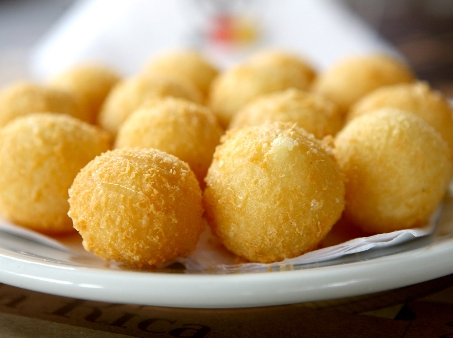

# Bolinho de parmesão

## Ingredientes

* 500g de parmesão ralado
* 50g de amido de milho
* 2 ovos
* Sal e pimenta a gosto

## Modo de Fazer

1. Misture todos os ingredientes até obter uma massa homogênea.
2. Fazer bolinhas.
3. Fritar.

## Referência

* [Receita](http://entretenimento.r7.com/receitas-e-dietas/noticias/faca-um-pratico-bolinho-de-parmesao-20091125.html)