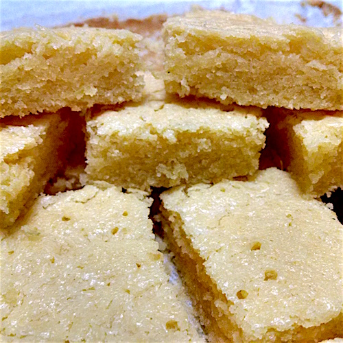

# Brownie de chocolate branco com limão

## Ingredientes

* 100g de chocolate branco
* 100g de manteiga
* 100g de açúcar
* 100g de farinha
* 2 ovos
* Cascas de 1 limão siciliano
* 2 colheres de sopa de suco de limão

## Modo de Fazer

1. Preaqueça o forno à 180 °C.
2. Derreta a manteiga e o chocolate em banho-maria. Reserve.
3. Em um recipiente grande, bata os ovos com o açúcar, até esbranquiçar.
4. Junte agora o chocolate derretido, vagarosamente para não cozinhar os ovos. Mexa bem.
5. Junte as raspas de limão, o suco e por último a farinha.
6. Mexa até deixar a mistura bem homogênea.
7. Em uma forma untada, asse por cerca de 25 a 35 minutos.

## Referência

* [Receita](http://www.eucomosim.com/receitas/brownie-de-chocolate-branco-com-limao/)