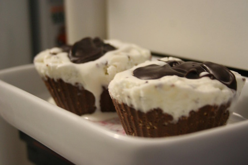

# Cupcake gelado de Nutella

## Ingredientes

* 350g de Nutella
* 1 pacote de biscoito maizena
* 1 pote de sorvete de flocos
* 170g de chocolate amargo
* 170ml de creme de leite

## Modo de Fazer

1. Com o auxílio de um processador ou liquidificador, triture bem os biscoitos.
2. Em uma tigela, junte os biscoitos triturados com a Nutella, misturando até obter uma massa.
3. Forre o fundo das forminhas com a massa, cubra com o sorvete e leve para gelar.
4. Derreta o chocolate e misture com o creme de leite.
5. Desenforme os cupcakes, cubra com o ganache e sirva.

## Referência

* [Receita](http://www.tudogostoso.com.br/receita/83743-cupcake-gelado-de-nutella.html)