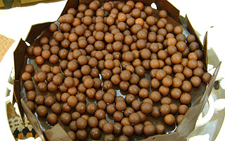

# Torta puro chocolate

## Ingredientes

* 1 caixa de bombons (400g)
* 500ml de creme de leite fresco
* 100mk de suco concentrado de maracujá
  * Ou leite de coco
  * Ou licor de menta
* 600g de chocolate meio amargo

## Modo de Fazer (massa)

1. Em um processador, triture os bombons até obter uma massa. 
2. Com esta massa, forre o fundo de uma forma de fundo removível com auxilio das mãos. Com
as costas de uma colher alise a superfície.

## Modo de Fazer (creme)

1. Leve o creme de leite ao fogo médio até ferver.
2. Quando ferver, desligue o fogo e acrescente o chocolate meio amargo bem picadinho e o suco de maracujá.
3. Mexa bem até dissolver o chocolate e obter uma mistura homogênea.
4. Deixe esfriar e após, transfira para a forma com a massa.
5. Leve à geladeira por cerca de 2h, até que o creme fique firme.

## Referência

* [Receita](http://gshow.globo.com/receitas/maisvoce/torta-puro-chocolate-4d50a9ec52e0b252bc004ac7)